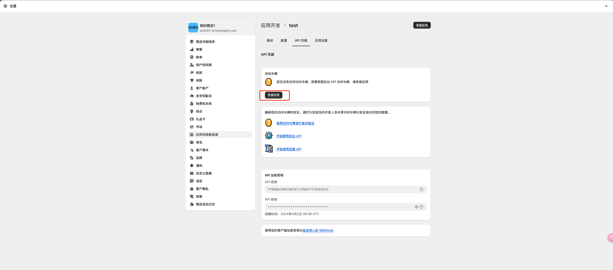

## 1. 登录[Shopify后台](https://accounts.shopify.com/)，点击设置

## 2. 点击“应用和销售渠道”和“创建应用”，输入应用名称和应用开发者的电子邮件

## 3. 转配置选项卡，点击“编辑”，勾选 write_draft_orders、 read_draft_orders、 write_order_edits、 read_order_edits、 write_orders、 read_orders、 write_gates、 read_gates、 write_payment_customizations、 read_payment_customizations

## 4. 转到API凭据选项卡，然后按“安装应用”。在后台 API 访问令牌

## 模块中点击“显示令牌一次”

## 5. 点击“收款”,找到手动支付方式模块。点击“添加手动收款方式”，点击“创建自定义支付方式”,填写对应的内容后，点击“激活”

## 6. 登录到[商户后台](https://merchants.beyounger.com/user/login)，点击收单>站点管理>选择站点编辑，选择平台为Shopify、填入步骤4中的saas_url、access_token字段输入谷歌验证码点击确定

##  7. 登录到[商户后台](https://merchants.beyounger.com/user/login)，点击开发者>API管理>选择站点查看，获取到您的Api Key和Api Secret

## 8. 点击设置>结账，找到“自定义脚本”，粘贴提供的脚本内容，单击“保存”

（1）脚本中搜索your domin替换为我们提供的apiUrl

（2）脚本中搜索your apiKey替换为商户后台的apiKey（步骤7）

（3）脚本中搜索your apiSecret替换为商户后台的apiSecret（步骤7）

## 9. 设置完成 请务必测试一笔是否成功 避免推广造成线上付款失败带来的损失

## 10. 付款以后 可登陆[商户后台](https://merchants.beyounger.com/user/login) 查看是否收单成功

## 11. 正式线上推广